# everybyte-coderooms

Everybyte Coderooms nakes your coding discussion easy using collaborative code editor and features like running the code, Voice Chat, Saving the code for further use and many more...

## Live at : <a href="https://everybyte-coderooms.herokuapp.com">https://everybyte-coderooms.herokuapp.com</a>

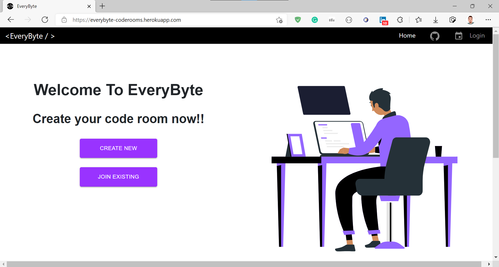

## Sign In using Google

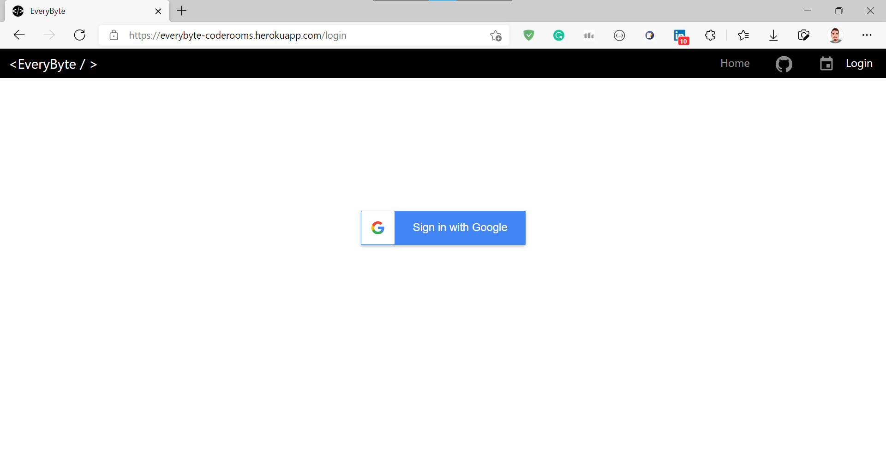

## Creating new room

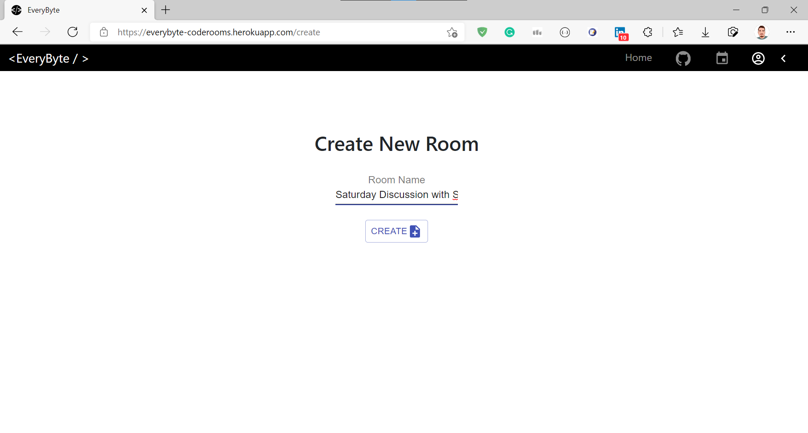

## Code Editor

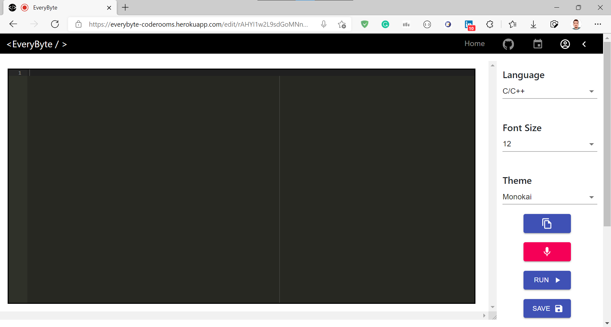
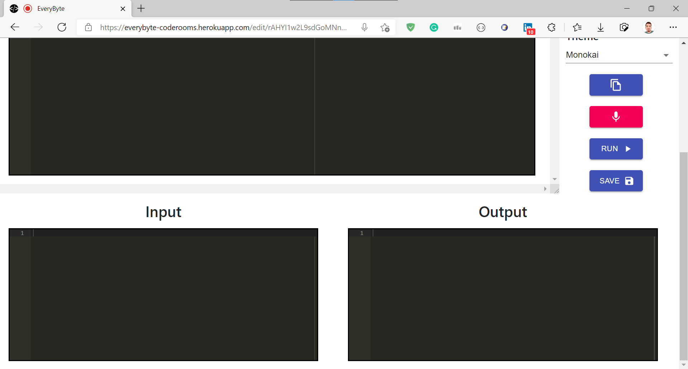

## Running the Code

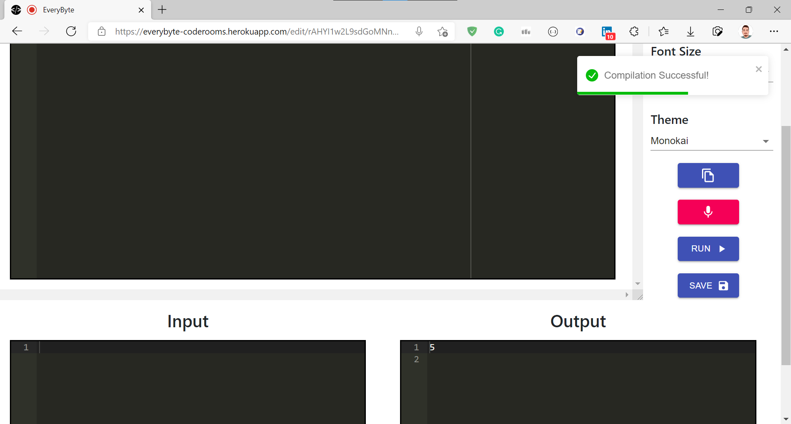

## Saving the Code

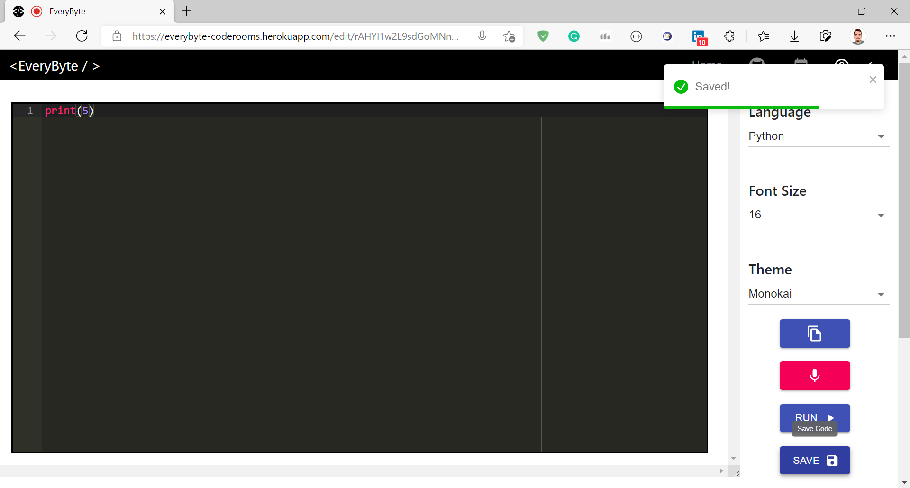

## Multiple user collaboration

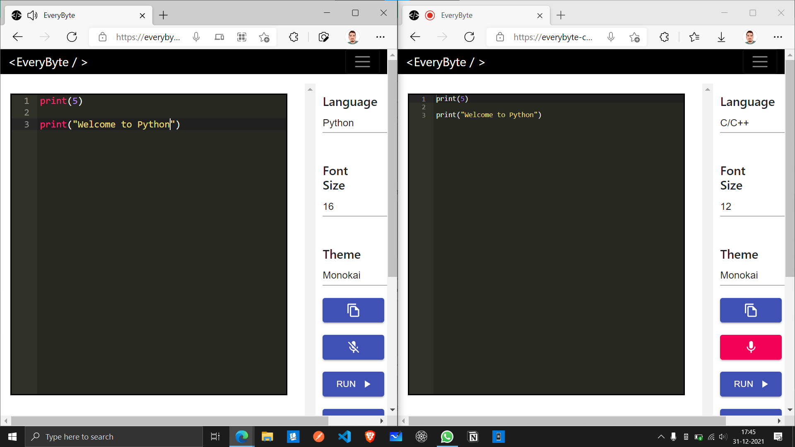

## Menu

## Dashboard

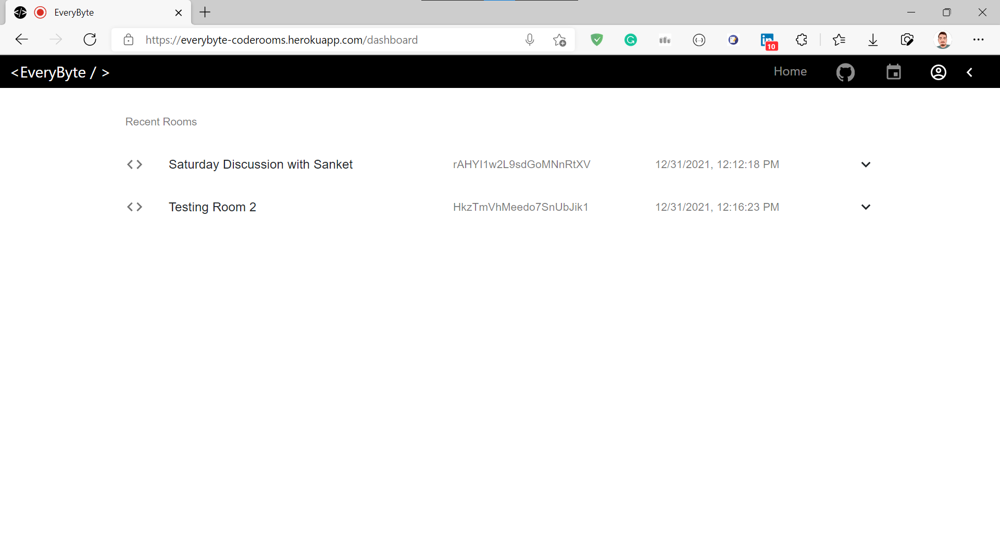

## Inviting other people to collaborate to room

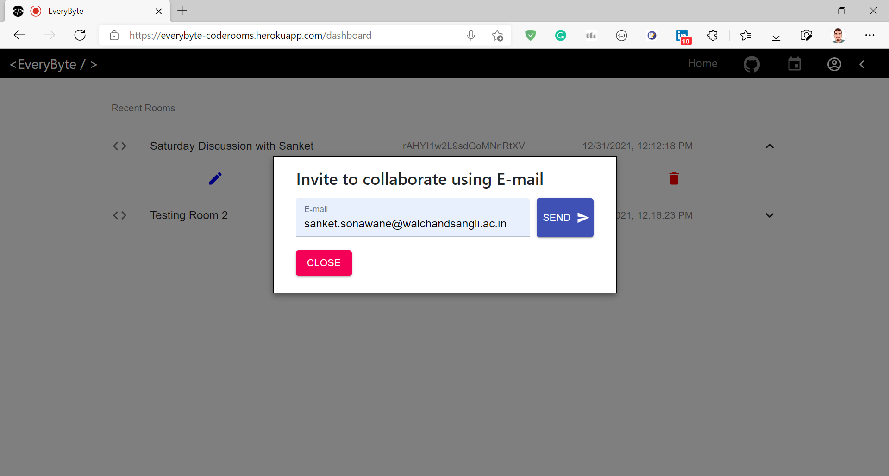
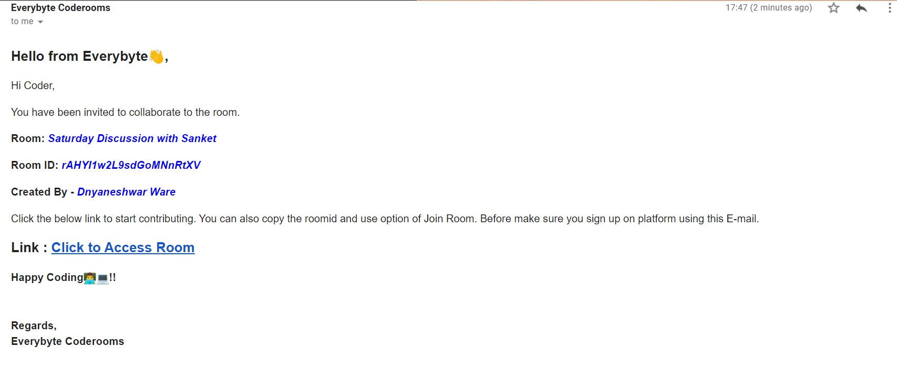

## Trying to access unauthorized or non-existing room

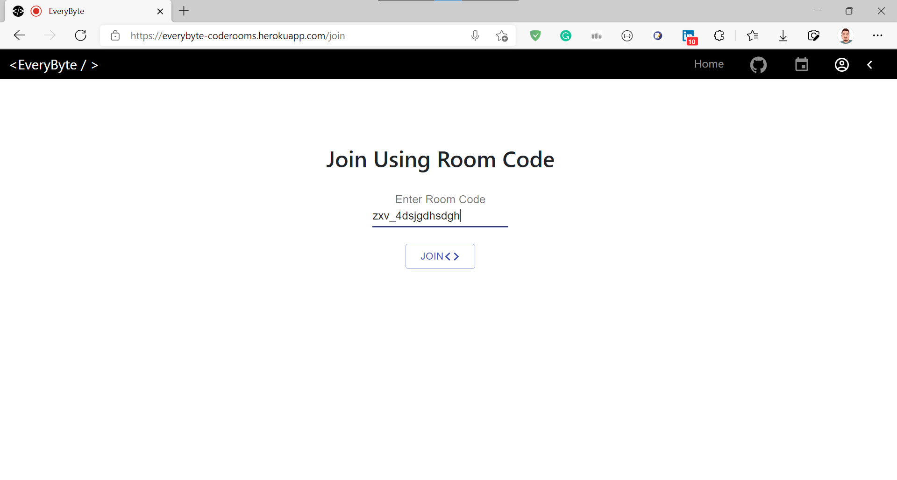
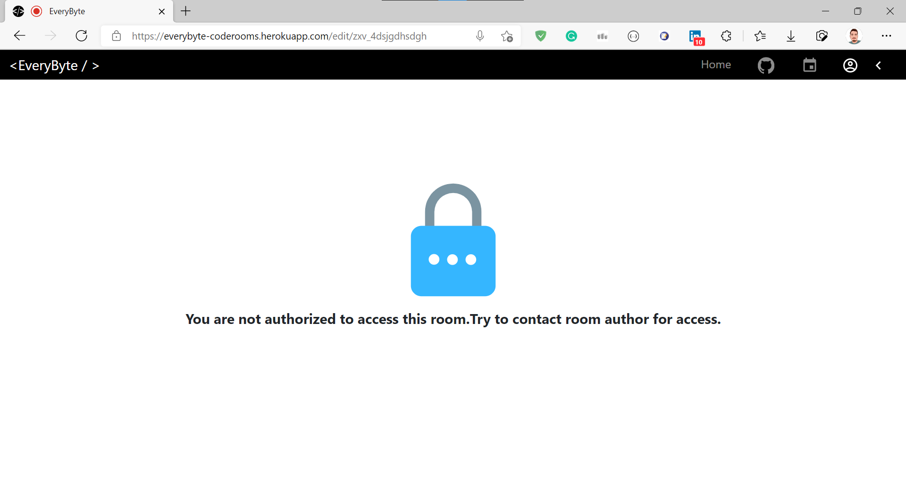
